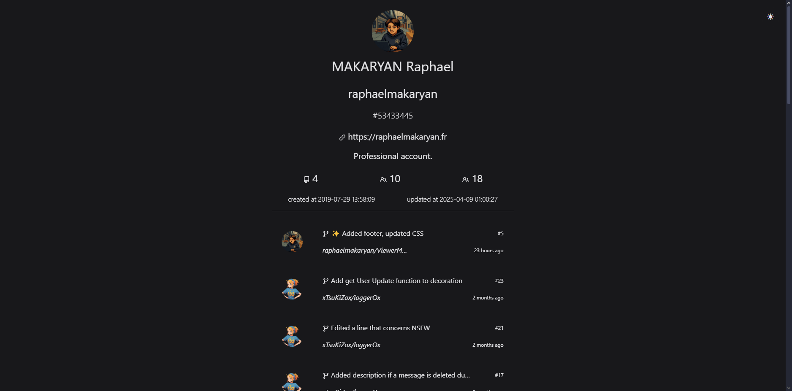

<a name="readme-top"></a>


<!-- LOGO -->
<br />
<div align="center">
    
  

  <h3 align="center">ViewerMyHub</h3>

  <p align="center">
    Welcome to the project : ViewerMyHub !
    <br>
    You are currently reading the documentation, happy reading :)
  </p>
</div>

<!-- TABLE  -->
<details>
  <summary>Table of Contents :</summary>
  <ol>
    <li>
      <a href="#about-the-project">About The Project</a>
      <ul>
       <li><a href="#built-with">Built With</a></li>
      </ul>
    </li>
    <li>
      <a href="#getting-started">Getting Started</a>
      <ul>
        <li><a href="#setup">Setup</a></li>
      </ul>
    </li>
    <li>
      <a href="#infos">Informations</a>
    </li>
        <li>
      <a href="#credits">Credits</a>
    </li>
        <li>
      <a href="#licence">Licence</a>
    </li>
  </ol>
</details>

<br>

---
<br>

<!-- ABOUT THE PROJECT -->
# About The Project

<br>

<div align="center">
  
</div>

<br>
ViewerMyHub is a project that allows you to view your recent GitHub pull requests on Open Source projects you contribute to only in PHP!

You too can view your recent GitHub pull requests on the Open Source projects you contribute to using ViewerMyHub!

[Demo here !](https://viewermyhub.raphaelmakaryan.fr/)

## Built With

This section presents the languages ​​and tools used:


<p align="right">(<a href="#readme-top">Back to top !</a>)</p>


<!-- GETTING STARTED -->
# Getting Started

To install and use ViewerMyHub correctly, follow the setup below :

## Setup

Download the code or do a git clone :

```bash
git clone https://github.com/raphaelmakaryan/ViewerMyHub.git
```

Rename ".env copy" to .env
```text
.env copy -> .env
```

Rename ".gitignore copy" to .gitignore
```text
.gitignore copy -> .gitignore
```

Create a GitHub token on [GitHub](https://github.com/settings/personal-access-tokens/new) and set it in the `.env` file along with the rest:

```bash
# GitHub API token and username
GITHUB_TOKEN = YOUR_GITHUB_TOKEN
GITHUB_USERNAME = YOUR_USERNAME

# GitHub API URL for issues
PAGE=1
PER_PAGE=50
```

<p align="right">(<a href="#readme-top">Back to top !</a>)</p>


<!-- INFORMATIONS -->
# Informations

ViewerMyHub was created to simplify your workflow, so you simply follow the setup and launch it either on a server (e.g., XAMPP) or on your own.

### You must use all the files created for this !

You are free to make your own choices.

<p align="right">(<a href="#readme-top">Back to top !</a>)</p>

<!-- CREDITS -->
# Credits

This project is inspired by [Sébastien Chopin](https://github.com/atinux)'s [project](https://github.com/atinux/my-pull-requests). 

Which his project was oriented towards Vuejs or globally in javascript, I turned to the same inspiration but in PHP and more simplified.

<p align="right">(<a href="#readme-top">Back to top !</a>)</p>

<!-- LICENCE -->
# License

[MIT](./LICENCE)

<p align="right">(<a href="#readme-top">Back to top !</a>)</p>